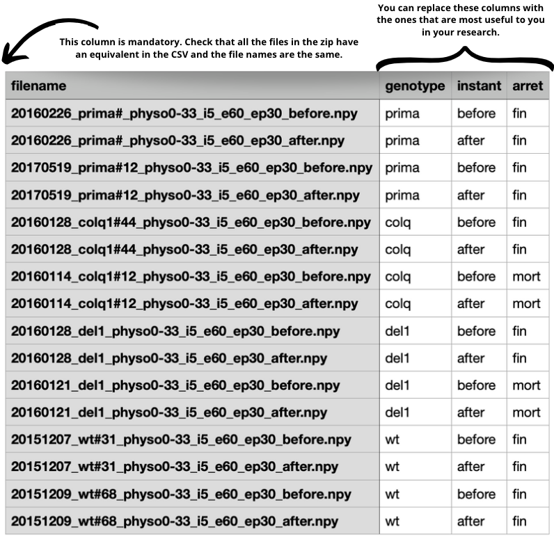
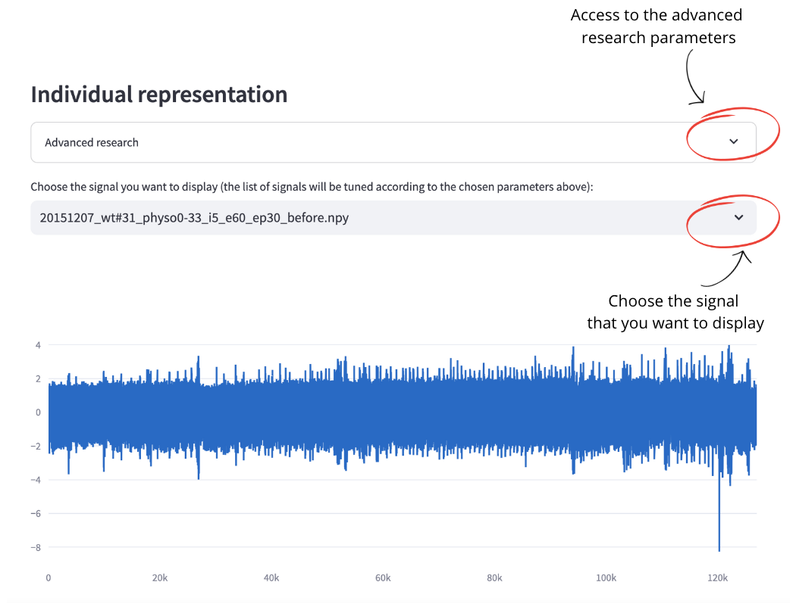
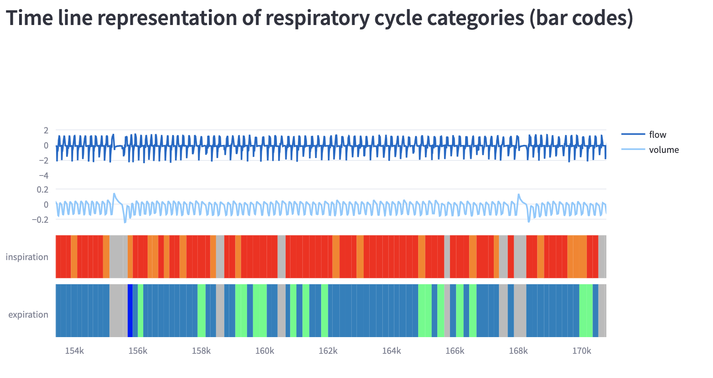
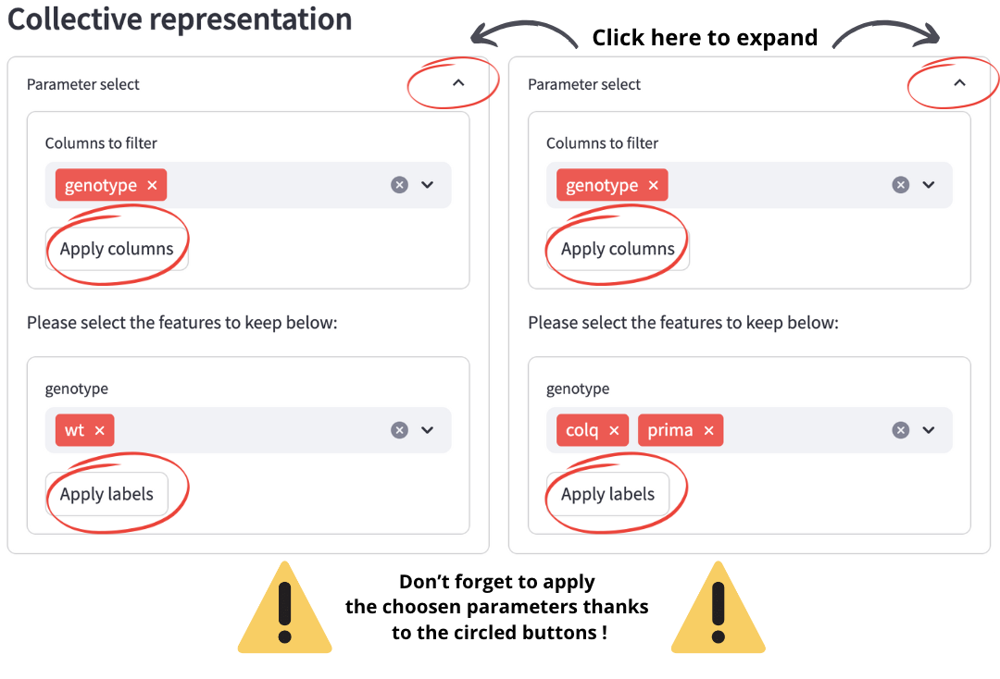

# Plethlit

This tab is dedicated to presenting a guide on how to use this application.

## Data selection
The first step to use the application is to select the datas. 
You have to enter a zip file in the column on the left, each file in the zip should represent an univariate Time-Series. 
The supported format are **.csv**, **.txt**, **.npy** and **.EDF**. 

To make the most of the application's functionalities, we also advise you to build a csv file with a column named **"filename"** containing the files names in the zip files and the other columns corresponding to a classification of your choice. See the following example: 

Once the zip file inserted, you will be able to insert the csv file in the left column.

## Visualization of the datas 
Once you have entered the datas, you will be able to visualize them on the tab **"Individual representation"**:

If you have entered a csv file that respects the precised format above, you will also be able to search a signal that you want to display based on the classification you made on your csv file.

Once you have clicked on the circled buttons, the advanced research parameters will be applied and only the time-series respecting the wished constraints will be displayed in the research bar.

## Parameters selection

## Visualization of the algorithm results
Once the algorithm has been executed, you'll be able to view several results, divided into three tabs: 

### Individual representation
The selection of the Time-Series that you want to visualize is done in the exact same way as explained above in the **Visualization of the datas** section. Now, once the wished Time-Series selected you will have new representations:

**Firstly**, you will see the *Time line representation of respiratory cycle categories*, also called **bar codes**: 

You can also zoom on a portion of the bar code of particular interest to you, to see what's going on in more detail.

Note that the portions in grey represents outliers that are too far to any typical respiratory cycle, in the examples we used they often corresponds to human manipulations or the death of the mouse.

**Then**, you will see the RC map of the selected Time-Series:
*A respiratory cycle (RC) map corresponds to a heat map where rows are inspiration symbols and columns are expiration symbols.*

For a better idea of what each box represents, see the **Representative respiratory cycles** tab.

### Collective representation

To be able to see results in the tab labeled **Collective representation**, you also need to have provided the csv file corresponding to your zip archive.

You will then have access to 2 selectors like the one described above, to be able to build 2 RC maps side-by-side to be able to visualize and compare the results for 2 given subsets of the parameter labels. 

Once the parameters **choosen** and **applied** you will have two RC maps, similars to the one in the tab **Individual representation** with the difference that this time, the map will be done based on **all** the time-series corresponding to the choosen parameters.

### Representative respiratory cycles

To be able to see results in the tab labeled **Representative cycles**, you do not need to provide the csv file corresponding to your zip archive.

You will find in this tab a grid figure displaying the medoids (real data examples closest to the centroids of the clusters) of the respiratory cycles. As before, the letters and numbers correspond to the inhalation and exhalation clusters respectively.